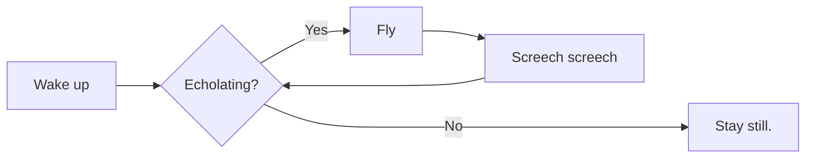
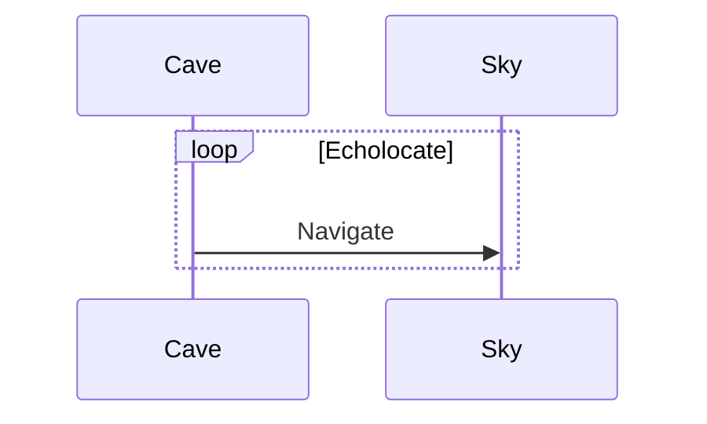

# Bat Flying Flow Chart

## A day in the life of Bat

```mermaid
graph LR
  A[Wake up] --> B{Echolating?};
  B -->|Yes| C[Fly];
  C --> D[Screech screech];
  D --> B;
  B ---->|No| E[Stay still.];
```

## Sequence Diagram

```mermaid
sequenceDiagram
  loop Echolocate
      Cave->>Sky: Navigate
  end
```